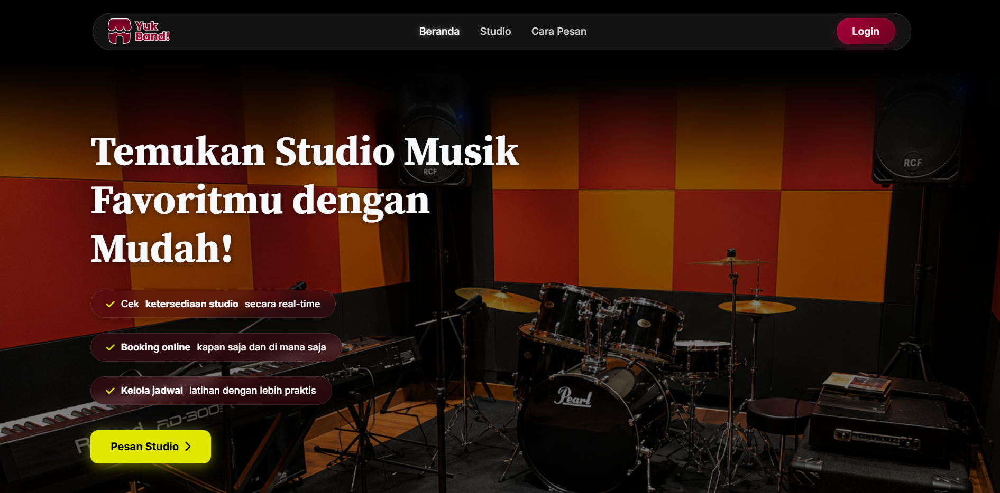
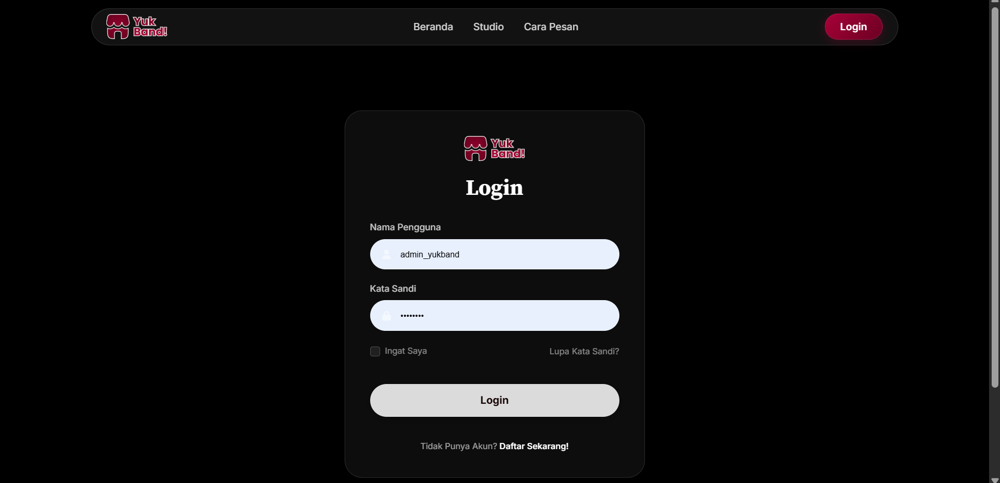
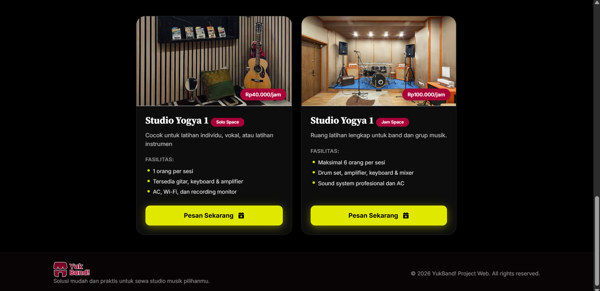
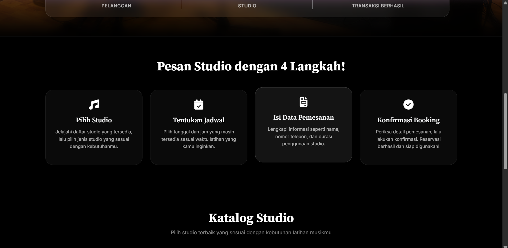
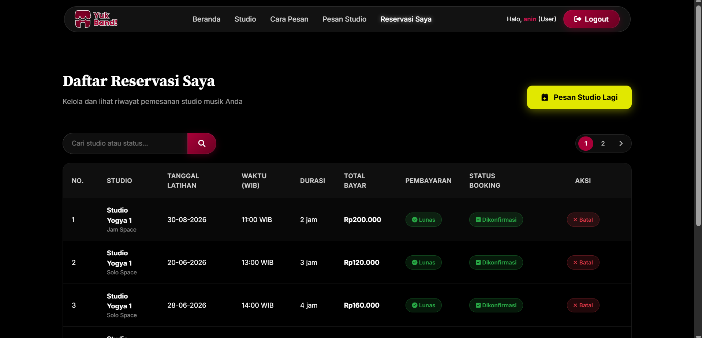
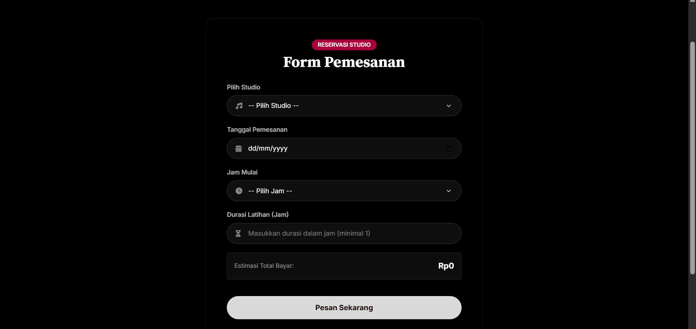
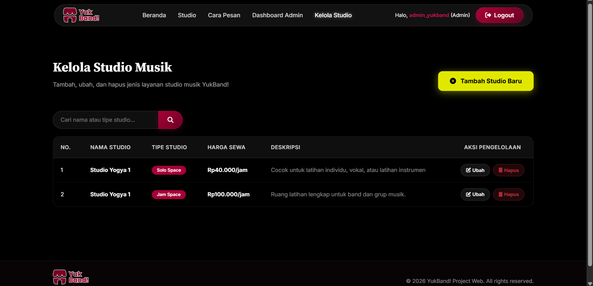
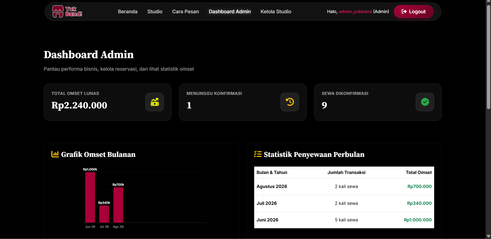
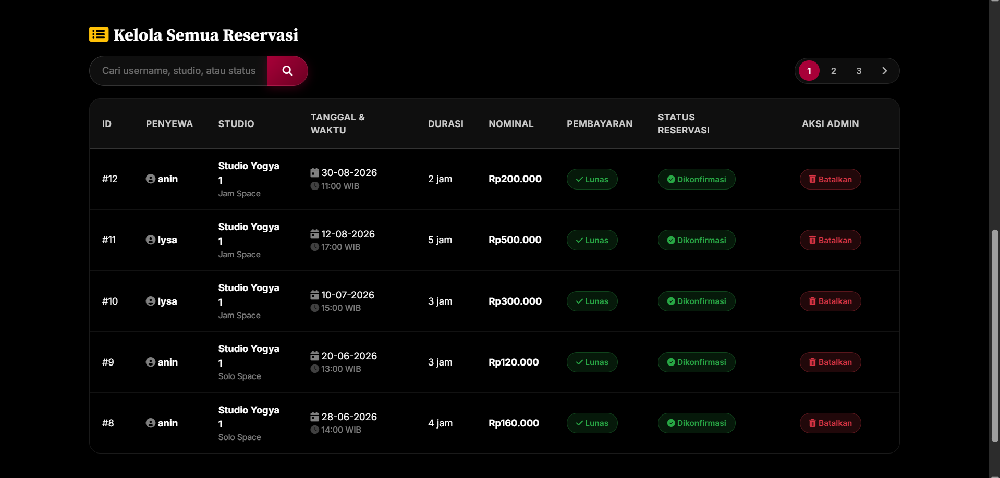

# YukBand!
Aplikasi web reservasi studio musik.

# Deskripsi
YukBand! memudahkan pengguna untuk memesan studio musik secara online.
Tersedia dua jenis studio yaitu Solo Space dan Jam Space.

# Fitur
- Landing page dengan katalog studio
- Sistem login & registrasi dengan enkripsi password
- Pemesanan studio online dengan cek ketersediaan otomatis
- Manajemen reservasi (user)
- Dashboard admin yaitu pengelolaan studio dan konfirmasi/batalkan reservasi

# Cara Menjalankan
1. Install XAMPP dan jalankan Apache + MySQL
2. Import db_yukband.sql ke phpMyAdmin
3. Copy folder proyek ke C:/xampp/htdocs/yukband/
4. Buka config.php, sesuaikan user/password database jika perlu
5. Akses http://localhost/yukband/ di browser

# Akun Default
| Role  | Username       | Password  |
|-------|----------------|-----------|
| Admin | admin_yukband  | admin123  |
| User  | anin           | anin123   |

# Screenshots

